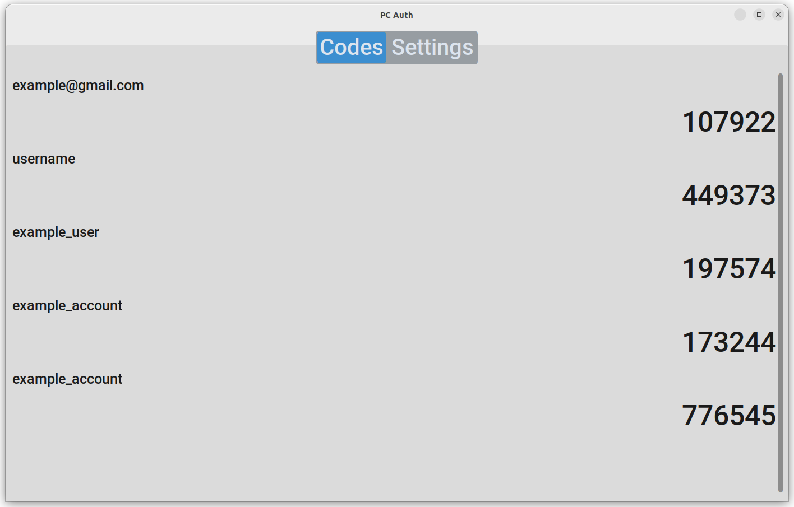

PC Auth Locks your otpauth TOTP keys safely away and acts as a TOTP Authenticator app. It generates codes at set intervals which you can use to log in.

How to compile:
pyinstaller --onefile --hidden-import PIL._tkinter_finder "PC Auth.py"

